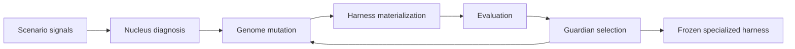

# StemOS

StemOS is a stem agent framework that differentiates into a task-specific operating harness.

It is not a universal agent. It is a universal differentiation mechanism. Each user-provided scenario produces a different specialized operating harness.

The user gives a scenario. Nucleus commands evolution. Genome mutates. Guardian protects. Harness materializes. The best organism freezes. The frozen harness executes future tasks.

## Architecture



## Why It Is Not A Universal Agent

StemOS does not hard-code bug fixing, research, QA, or any other task domain. It reads a scenario package, evolves a genome, materializes a candidate harness, evaluates it, and freezes the best specialized harness for that scenario.

The genome is the developmental blueprint. It can encode roles, workflow, tools, memory, self-evaluation, quality gates, retry policy, and environment layout.

StemOS may evolve roles, but roles are not predefined subagents. They are phenotypic structures produced by genome mutations and retained only if Guardian fitness improves. In the demo, adding more roles is not automatically rewarded; harmful or redundant roles are rolled back.

## Immutable vs Mutable Boundary

Immutable Guardian kernel:

- `src/stemos/kernel/guardian.py`
- `src/stemos/kernel/evaluator.py`
- `src/stemos/kernel/sandbox.py`
- `src/stemos/kernel/versioning.py`
- `src/stemos/kernel/budget.py`
- `src/stemos/kernel/validators.py`
- hidden evaluation, rollback, lineage, mutation validation, and budget limits

Mutable genome:

- roles
- workflow
- tool specs
- generated tools after sandbox checks
- memory schema
- quality gates
- self-evaluation rubric
- retry policy
- stop rule
- environment layout and artifacts

Nucleus may evolve mutable self-evaluation. It must never modify immutable Guardian fitness.

## Setup

```bash
git clone <repo-url>
cd stemos
python -m venv .venv
source .venv/bin/activate
pip install -e ".[dev]"
cp .env.example .env
export OPENAI_API_KEY=""
pytest
```

Offline deterministic mode is enabled by default and does not require real OpenAI calls:

```bash
export STEMOS_OFFLINE_MODE=true
```

## Provide A Scenario

Create a new scenario package:

```bash
stemos init-scenario scenarios/my_scenario
```

A scenario contains:

- `scenario.yaml`
- `train_cases.jsonl`
- `validation_cases.jsonl`

Validation cases are used for promotion when present, so evolution cannot promote a genome only because it overfits training cases.

## Run Evolution

Smoke test:

```bash
stemos evolve scenarios/toy_structured_answer --run-id smoke_001
```

Stronger demo:

```bash
stemos evolve scenarios/tiny_task_operator --run-id demo_001
```

Optional Git provenance is off by default:

```bash
stemos evolve scenarios/toy_structured_answer --run-id demo_001 --git-branch --git-commit
```

This creates a local branch named `stemos/run/<run_id>` and commits only at safe evolution points such as baseline evaluation, promoted mutations, rejected or rolled-back mutations, generation completion, pause/resume, and final freeze. Git is provenance only; runtime recovery still uses checkpoint files under `runs/<run_id>/checkpoint/latest/`.

Push is never automatic unless explicitly requested:

```bash
stemos evolve scenarios/toy_structured_answer --run-id demo_001 --git-branch --git-commit --git-push
stemos push-run demo_001
```

Before committing or pushing, StemOS scans staged files for `.env`, `OPENAI_API_KEY`, common secret patterns, and large temporary files.

The run writes:

- `runs/<run_id>/config_snapshot.yaml`
- `runs/<run_id>/baseline_genome.yaml`
- `runs/<run_id>/frozen_genome.yaml`
- `runs/<run_id>/lineage.jsonl`
- `runs/<run_id>/report.md`
- per-generation genomes, mutation plans, traces, outputs, and evaluation results

## Inspect Before And After

```bash
stemos inspect runs/demo_001
stemos compare runs/demo_001
```

`report.md` includes:

- baseline genome score
- evolved genome score
- promoted mutations
- rejected or rolled-back mutations
- frozen genome path
- before/after comparison
- lineage narrative explaining how the harness differentiated

## Safe Stop Controls

Each run has a control file at `runs/<run_id>/control.json`.

```bash
stemos pause demo_001
stemos resume demo_001
stemos status demo_001
stemos freeze-now demo_001
stemos abort demo_001
```

The evolution loop checks `control.json` at safe points. Pause saves a checkpoint and exits cleanly. Resume validates the scenario hash and continues from `checkpoint/latest/state.json`. Freeze-now freezes the best verified genome, never an unverified candidate. Abort saves state and does not promote the current candidate.

## Execute A Frozen Harness

```bash
stemos execute runs/demo_001/frozen_genome.yaml --input "Help me plan a focused workday."
```

## Safety Limitations

This MVP has a deterministic local fallback and a narrow OpenAI adapter. Generated tools are statically checked for forbidden imports and must include tests before activation. The sandbox is intentionally conservative and should be hardened further before running untrusted code outside local demos.

Forbidden imports for generated tools include:

- `os`
- `subprocess`
- `socket`
- `requests`
- `httpx`
- `shutil`
- `pathlib`

## Example Run

```bash
stemos evolve scenarios/tiny_task_operator --run-id demo_001
stemos compare runs/demo_001
```

Expected shape:

```text
Baseline score: 0.34
Final score: 0.87
Promoted mutations:
  - modify_self_evaluation -> self_evaluation
  - modify_environment -> environment
Rejected or rolled back mutations:
  - mutation_rejected create_tool -> tools.generated
```
