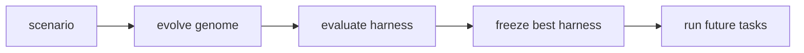

# stem_agent

`stem_agent` evolves a task-specific operating harness from a scenario.

It is not a universal agent. It is a system that learns the shape of a useful agent for one task family, freezes the best verified harness, and then lets you run that frozen harness on future inputs.

The short version:



## Quick Start

Install once:

```bash
python3 -m venv .venv
source .venv/bin/activate
pip install -e ".[dev]"
```

Optional API setup starts from the template:

```bash
cp .env.example .env
```

For local deterministic runs, keep these values in `.env`:

```bash
STEM_AGENT_OFFLINE_MODE=true
OPENAI_API_KEY=
```

For OpenAI-backed runs, set:

```bash
OPENAI_API_KEY=...
STEM_AGENT_OFFLINE_MODE=false
STEM_AGENT_MODEL=gpt-4.1-mini
STEM_AGENT_OPENAI_ENDPOINT=chat_completions
```

Load `.env` into your shell before running commands:

```bash
set -a
source .env
set +a
```

Run a demo in 3 commands:

```bash
stem_agent evolve scenarios/toy_structured_answer --run-id demo_001
stem_agent inspect runs/demo_001
stem_agent execute runs/demo_001/frozen_genome.yaml --input "Help me plan a focused workday."
```

The main human-readable output is:

```text
runs/demo_001/report.md
```

Everything else in the run folder is mostly audit data, checkpoints, traces, and agent/runtime state.

## Train On GSM8K Mini

For a real benchmark-style run:

```bash
stem_agent init-benchmark gsm8k_mini --n-train 30 --n-val 20
stem_agent evolve scenarios/gsm8k_mini --run-id gsm8k_001
stem_agent inspect runs/gsm8k_001
```

`stem_agent inspect` prints the run report. The same report is saved at:

```text
runs/gsm8k_001/report.md
```

If you want to run the frozen harness after training:

```bash
stem_agent execute runs/gsm8k_001/frozen_genome.yaml --input "A class has 6 tables with 4 students each. How many students are there?"
```

## During Training

Training can be paused, resumed, or frozen safely. These commands act on the run id:

```bash
stem_agent pause gsm8k_001
stem_agent resume gsm8k_001
stem_agent status gsm8k_001
stem_agent freeze-now gsm8k_001
```

What they mean:

- `pause`: save a safe checkpoint and stop
- `resume`: continue from the latest checkpoint
- `status`: show the current control/checkpoint state
- `freeze-now`: freeze the best verified genome so far

Abort is available if you want to stop without promoting the current candidate:

```bash
stem_agent abort gsm8k_001
```

## What To Read

For humans, start here:

```text
runs/<run_id>/report.md
```

The report includes:

- baseline score
- final score
- promoted mutations
- rejected or rolled-back mutations
- genome archive summary
- before/after harness shape
- Guardian selection board
- hidden eval vs train eval when hidden cases exist
- frozen genome path

Most users should not need to read the lower-level files unless debugging.

Useful optional commands:

```bash
stem_agent compare runs/gsm8k_001
stem_agent visualize runs/gsm8k_001
```

Use `compare` for a small score summary. Use `visualize` when you want extra markdown files under `runs/<run_id>/visuals/`.

## Scenario Layout

A scenario folder usually contains:

```text
scenario.yaml
train_cases.jsonl
validation_cases.jsonl
hidden_cases.jsonl    # optional
```

Create a starter scenario:

```bash
stem_agent init-scenario scenarios/my_scenario
```

Validation cases are used for promotion. Hidden cases are only used for observability: they are logged and visualized, but never shown to Nucleus and never used as the promotion score.

## Information Flow

The key safety design is that Nucleus, the mutation proposer, gets directional feedback but not the answer key.

`Layer 0`: always visible

- scenario task description
- current genome structure
- generation number
- mutation type
- direction: `improved`, `degraded`, or `neutral`

`Layer 1`: aggregate signal, configurable

- aggregate score
- previous aggregate score
- score delta

`Layer 2`: never visible to Nucleus

- validation case inputs
- expected outputs / answer keys
- per-case scores
- Guardian criterion breakdowns
- hidden eval scores
- hidden case details

The practical rule: Nucleus can see the dashboard, never the answer key.

This policy is implemented in:

```text
src/stemos/kernel/signal_policy.py
```

Scenario-level signal policy:

```yaml
signal_policy:
  layer_1_enabled: true
  expose_aggregate_score: true
  expose_score_delta: true
  expose_direction: true
```

Run an ablation where Nucleus does not see aggregate scores:

```bash
stem_agent evolve scenarios/gsm8k_mini --run-id gsm8k_blind --signal-policy-override layer_1_enabled=false
stem_agent evolve scenarios/gsm8k_mini --run-id gsm8k_signal
stem_agent compare-ablations runs/gsm8k_blind runs/gsm8k_signal
```

The comparison report is written to:

```text
runs/ablation_comparison.md
```

## Architecture

The genome is the mutable blueprint. It can evolve:

- roles
- workflow
- tools
- memory schema
- quality gates
- self-evaluation rubric
- retry policy
- stop rule
- environment layout and artifacts

The Guardian kernel is the immutable safety/evaluation boundary:

- mutation validation
- sandbox checks
- fitness evaluation
- hidden evaluation logging
- budget limits
- rollback/provenance checks
- signal policy enforcement

Nucleus may propose mutations to the mutable genome. It must not modify Guardian scoring, validation cases, hidden evaluation, budget logic, rollback logic, or signal policy enforcement.

## Run Folder

The top-level file for people is:

```text
runs/<run_id>/report.md
```

Other top-level files are mostly audit and recovery state:

- `baseline_genome.yaml`
- `frozen_genome.yaml`
- `baseline_genome_score.json`
- `lineage.jsonl`
- `archive.jsonl`
- `llm_calls.jsonl`
- `hidden_eval_log.jsonl`
- `rubric_audit.jsonl`
- `checkpoint/latest/`
- `generation_*/`
- `visuals/`

You can think of `report.md` as the readable story, and the rest as the evidence trail.

## OpenAI Mode

Offline deterministic mode is the default. To use OpenAI-backed evaluation or mutation calls, install the OpenAI extra, create `.env`, edit the API values, then load them into your shell:

```bash
pip install -e ".[dev,openai]"
cp .env.example .env
```

Put this in `.env`:

```bash
OPENAI_API_KEY=sk-...
STEM_AGENT_OFFLINE_MODE=false
STEM_AGENT_MODEL=gpt-4.1-mini
STEM_AGENT_OPENAI_ENDPOINT=chat_completions
```

Then load it and run:

```bash
set -a
source .env
set +a

stem_agent evolve scenarios/toy_structured_answer --run-id openai_001
```

To return to local/offline runs, set `.env` back to:

```bash
STEM_AGENT_OFFLINE_MODE=true
OPENAI_API_KEY=
```

The app does not auto-load `.env`; source it in each new shell before running `stem_agent`.

## Git Provenance

Git provenance is optional:

```bash
stem_agent evolve scenarios/toy_structured_answer --run-id demo_001 --git-branch --git-commit
```

This creates a local branch named `stem_agent/run/<run_id>` and commits only at safe points such as baseline evaluation, promoted mutations, rollback, pause/resume, and final freeze.

Push is never automatic unless requested:

```bash
stem_agent push-run demo_001
```

Before committing or pushing, stem_agent scans staged files for `.env`, `OPENAI_API_KEY`, common secret patterns, and large temporary files.

## Safety Notes

Generated tools are statically checked and must include tests before activation. The sandbox is conservative and should be hardened further before running untrusted code outside local demos.

Forbidden imports for generated tools include:

- `os`
- `subprocess`
- `socket`
- `requests`
- `httpx`
- `shutil`
- `pathlib`
