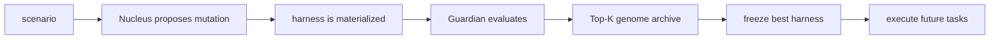

# stem_agent

`stem_agent` evolves a task-specific operating harness from a scenario, evaluates each mutation behind a Guardian boundary, then freezes the best verified harness for future use.

It is not a universal agent. It is a system for growing one useful agent shape for one task family.

## ⚡ Quick Start

Get a real API-backed agent run going first. `stem_agent` requires `OPENAI_API_KEY`; Nucleus and Guardian are separate OpenAI calls.

### 1. Install

```bash
git clone <repo-url>
cd stem_agent
python3 -m venv .venv
source .venv/bin/activate
pip install -e ".[dev,openai]"
```

What this does:

- creates a local Python environment
- installs the `stem_agent` CLI
- installs test/development dependencies
- installs the OpenAI client used by Nucleus, Guardian, and harness roles

### 2. Create `.env`

```bash
cp .env.example .env
```

Put your API settings in `.env`:

```bash
OPENAI_API_KEY=sk-...
STEM_AGENT_MODEL=gpt-4.1-mini
STEM_AGENT_OPENAI_ENDPOINT=chat_completions
```

Load `.env` into your shell:

```bash
set -a
source .env
set +a
```

### 3. Run The Demo

```bash
stem_agent evolve scenarios/toy_structured_answer --run-id demo_001
```

Expected result:

```text
✅ evolution finishes
✅ runs/demo_001/report.md is created
✅ runs/demo_001/frozen_genome.yaml is created
```

The most important file for humans is:

```text
runs/demo_001/report.md
```

After the run finishes, inspect it with:

```bash
stem_agent inspect runs/demo_001
```

Run the frozen harness on a fresh input with:

```bash
stem_agent execute runs/demo_001/frozen_genome.yaml --input "Help me plan a focused workday."
```

Everything else in the run folder is audit data, checkpoints, traces, or runtime state.

## 🧬 How stem_agent Works

The short version:



Core pieces:

1. 🧠 `Nucleus` proposes one genome mutation at a time.
2. 🛡️ `Guardian` evaluates the resulting harness and blocks unsafe changes.
3. 🧬 `GenomeArchive` keeps a Top-K set of strong genomes instead of greedy hill-climbing.
4. 📌 The best verified genome is frozen as `frozen_genome.yaml`.

The mutable genome can evolve:

- roles
- workflow
- tools
- memory schema
- quality gates
- self-evaluation rubric
- retry policy
- stop rule
- environment layout and artifacts

The immutable Guardian boundary protects:

- mutation validation
- sandbox checks
- fitness evaluation
- hidden evaluation logging
- budget limits
- rollback/provenance checks
- signal policy enforcement

## 🔑 API Setup

OpenAI API mode is required for normal use because the system should always have a real agent behind Nucleus, Guardian, and role execution.

Install the OpenAI extra:

```bash
pip install -e ".[dev,openai]"
```

Put your API settings in `.env`:

```bash
OPENAI_API_KEY=sk-...
STEM_AGENT_MODEL=gpt-4.1-mini
STEM_AGENT_OPENAI_ENDPOINT=chat_completions
```

Load the file before running:

```bash
set -a
source .env
set +a
```

Run a demo:

```bash
stem_agent evolve scenarios/toy_structured_answer --run-id openai_001
stem_agent inspect runs/openai_001
```

Note: the app does not auto-load `.env`. Source it in each new shell before running `stem_agent`.

## 🧪 GSM8K Demo vs Full Training

`stem_agent` has two GSM8K presets:

- `gsm8k_demo`: a small smoke benchmark. Use it to confirm the math-reasoning training loop runs end to end.
- `gsm8k_full`: a larger fixed-seed training/evaluation setup. Use it for reports or more credible benchmark-style experiments.

`gsm8k_demo` is intentionally small and should not be reported as an official GSM8K result.
The old `gsm8k_mini` name is kept only as a backwards-compatible alias for `gsm8k_demo`.

```bash
stem_agent init-benchmark gsm8k_demo
stem_agent evolve scenarios/gsm8k_demo --run-id gsm8k_demo_001
stem_agent inspect runs/gsm8k_demo_001
```

For fuller training:

```bash
stem_agent init-benchmark gsm8k_full
stem_agent evolve scenarios/gsm8k_full --run-id gsm8k_full_001
stem_agent inspect runs/gsm8k_full_001
```

Default split sizes:

| Preset | Intended use | Train | Validation | Hidden |
|---|---|---:|---:|---:|
| `gsm8k_demo` | smoke test / quick demo | 5 | 5 | 10 |
| `gsm8k_full` | report-oriented training run | 100 | 100 | 200 |

`gsm8k_full` expects access to the official GSM8K data through `datasets` or the upstream
grade-school-math JSONL files. The built-in fallback rows are only meant to keep
`gsm8k_demo` usable offline.

What each command does:

- `init-benchmark`: downloads and writes the scenario train/validation/hidden data
- `evolve`: runs mutation, evaluation, archive selection, rollback, and final freeze
- `inspect`: prints the top-level report

The readable report is saved under the selected run directory, for example:

```text
runs/gsm8k_full_001/report.md
```

Run the frozen harness after training:

```bash
stem_agent execute runs/gsm8k_full_001/frozen_genome.yaml --input "A class has 6 tables with 4 students each. How many students are there?"
```

## 🧪 Robustness Demo Suite

The repo also includes three small, static robustness demos that exercise different task classes.
They follow the same naming idea as `gsm8k_demo`: small enough to run quickly, but not large enough to report as a final benchmark.

The simple mental model is: change the scenario/parser, then let the same stem-agent loop differentiate.
Here the scenario acts like the task parser: it names the input fields, expected output sections, constraints, and evaluator criteria.

List the available benchmarks:

```bash
stem_agent list-benchmarks
```

| Scenario | Task class | What it tests |
|---|---|---|
| `security_review_demo` | `security_review_triage` | Reviews designs such as password reset, OAuth callbacks, or CI/CD flows for threat model, severity, remediation, and verification. |
| `research_synthesis_demo` | `deep_research_synthesis` | Synthesizes supplied notes into evidence, assumptions, unknowns, confidence, recommendation, and final answer. |
| `release_qa_triage_demo` | `release_quality_triage` | Triage releases such as checkout, billing, API, or migration changes with test plan, risk register, go/no-go call, and rollback. |

Run them one at a time:

```bash
make evolve-security-review-demo
make evolve-research-synthesis-demo
make evolve-release-qa-triage-demo
```

Or run the demo suite sequentially:

```bash
make evolve-robustness-demo
```

Each demo benchmark includes:

- train and validation cases for promotion
- external benchmark cases for an aggregate auxiliary signal
- hidden cases for observational leakage-safe checks
- final holdout cases for the frozen harness

For full training, create a matching `*_full` scenario with much larger fixed splits.
The demo rows are useful for smoke tests; a report-oriented full run should have enough examples to measure generalization, for example 50-100 train cases, 50 validation cases, and separate hidden/final holdout sets.

## 🛑 Safe Stop Controls

Training can be safely paused, resumed, inspected, or frozen. These commands use the run id, not the run path:

```bash
stem_agent pause gsm8k_full_001
stem_agent status gsm8k_full_001
stem_agent resume gsm8k_full_001
stem_agent freeze-now gsm8k_full_001
```

Meaning:

- `pause`: save a checkpoint and stop cleanly
- `status`: show control/checkpoint state
- `resume`: continue from `checkpoint/latest/`
- `freeze-now`: freeze the best verified genome so far

Abort without promoting the current candidate:

```bash
stem_agent abort gsm8k_full_001
```

## 📖 What To Read First

Start with the report:

```text
runs/<run_id>/report.md
```

It contains:

- baseline score
- final score
- promoted mutations
- rejected or rolled-back mutations
- genome archive summary
- before/after harness shape
- Guardian selection board
- hidden eval vs train eval when hidden cases exist
- frozen genome path

Use only the two main inspection commands unless you are debugging:

```bash
stem_agent inspect runs/gsm8k_full_001
stem_agent visualize runs/gsm8k_full_001
```

`inspect` is the normal human view. `visualize` writes extra markdown panels under `runs/<run_id>/visuals/`.

## 🗂️ Run Folder Rules

A run folder usually contains:

```text
runs/<run_id>/
  report.md                 # human-readable summary
  frozen_genome.yaml         # best verified harness
  baseline_genome_score.json
  lineage.jsonl              # mutation decisions
  archive.jsonl              # Top-K genome archive
  llm_calls.jsonl            # Nucleus/Guardian call audit
  checkpoint/latest/         # resume state
  generation_*/              # detailed traces
  visuals/                   # optional charts/panels
```

Git rule:

- keep raw experiment runs local
- do not upload every `runs/*` folder
- keep only one curated showcase run in Git, currently `runs/demo_001/`
- if another run becomes the best demo result, replace the curated run intentionally

`.gitignore` already ignores ad-hoc `runs/*` outputs by default.

## 🚦 Information Flow

The important safety idea: Nucleus gets useful feedback, but never gets the answer key.

### Layer 0: Always Visible

- scenario task description
- current genome structure
- generation number
- mutation type
- direction: `improved`, `degraded`, or `neutral`

### Layer 1: Aggregate Signal

Configurable and enabled by default:

- aggregate score
- previous aggregate score
- score delta

### Layer 2: Never Visible To Nucleus

- validation case inputs
- expected outputs / answer keys
- per-case scores
- Guardian criterion breakdowns
- hidden eval scores
- hidden case details

Practical rule:

```text
Nucleus can see the dashboard.
Nucleus cannot see the answer key.
```

The policy lives here:

```text
src/stem_agent/kernel/signal_policy.py
```

Scenario-level configuration:

```yaml
signal_policy:
  layer_1_enabled: true
  expose_aggregate_score: true
  expose_score_delta: true
  expose_direction: true
```

Run a signal-policy ablation:

```bash
stem_agent evolve scenarios/gsm8k_full --run-id gsm8k_blind --signal-policy-override layer_1_enabled=false
stem_agent evolve scenarios/gsm8k_full --run-id gsm8k_signal
stem_agent compare-ablations runs/gsm8k_blind runs/gsm8k_signal
```

The comparison report is written to:

```text
runs/ablation_comparison.md
```

## 🧩 Scenario Layout

A scenario folder usually contains:

```text
scenario.yaml
train_cases.jsonl
validation_cases.jsonl
hidden_cases.jsonl    # optional
external_benchmark_cases.jsonl  # optional auxiliary signal
final_holdout_cases.jsonl       # optional final frozen-harness check
```

Create a starter scenario:

```bash
stem_agent init-scenario scenarios/my_scenario
```

Validation cases are used for promotion. Hidden cases are only used for observability: they are logged and visualized, but never shown to Nucleus and never used as the promotion score.

## 🌿 Git Provenance

Git provenance is optional and should be used sparingly.

```bash
stem_agent evolve scenarios/toy_structured_answer --run-id demo_001 --git-branch --git-commit
```

This creates a local branch named `stem_agent/run/<run_id>` and commits only at safe points such as baseline evaluation, promoted mutations, rollback, pause/resume, and final freeze.

Push is never automatic unless requested:

```bash
stem_agent push-run demo_001
```

Before committing or pushing, `stem_agent` scans staged files for `.env`, `OPENAI_API_KEY`, common secret patterns, and large temporary files.

## 🧯 Safety Notes

Generated tools are statically checked and must include tests before activation. The sandbox is conservative and should be hardened further before running untrusted code outside local demos.

Forbidden imports for generated tools include:

- `os`
- `subprocess`
- `socket`
- `requests`
- `httpx`
- `shutil`

`pathlib` is allowed for read-only operations. Write methods (`write_text`,
`unlink`, `mkdir`, etc.) are blocked at the AST level.

## 🐛 SWE-bench Code-Patch Scenario

`stem_agent` includes a code-patch-generation scenario based on SWE-bench Lite:

```bash
# View available benchmarks (includes swebench_lite_demo)
stem_agent list-benchmarks

# Run the code-patch scenario
stem_agent evolve scenarios/swebench_lite_demo --run-id sweb_demo_001
```

The SWE-bench scenario uses:
- **3 roles**: locator (code search), patcher (diff generation), verifier (dry-run)
- **New built-in tools**: `search_code`, `write_patch`, `apply_patch_dry_run`
- **Mock evaluation mode**: `STEM_AGENT_SWEBENCH_MOCK=1` for offline development
- **Real evaluation**: requires Docker + the `swebench` package

## ⚠️ Limitations

This project is a research prototype. Known limitations:

- **Evaluator is heuristic-based**: Most scoring uses keyword matching, not semantic
  understanding. Scores can be noisy for open-ended tasks.
- **Single LLM provider**: Currently OpenAI-only. Provider abstraction exists but
  only OpenAI is implemented.
- **Sequential evaluation**: Cases run one at a time. No parallelism.
- **No Docker sandbox**: Generated tools pass static AST checks but may run in-process.
- **Budget tracking**: Virtual cost estimates in test mode can be inaccurate.
- **max_generations**: Default 5-7 may not be enough for complex scenarios to
  reach stagnation-based operator escalation (ZeroOrder at gen 5, Hyper at gen 8).

For the latest experimental results, see `baseline_runs/BEFORE_AFTER_REPORT.md`.
