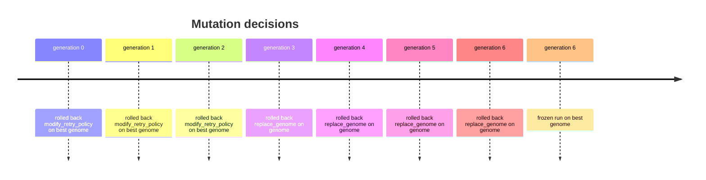
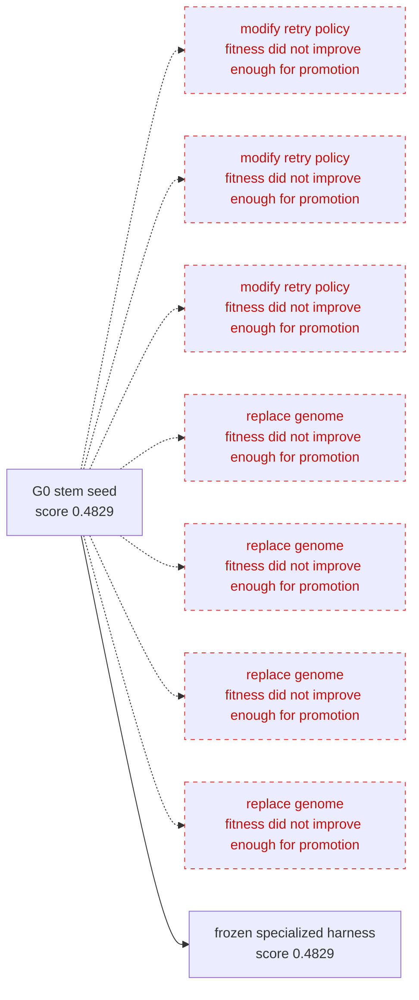
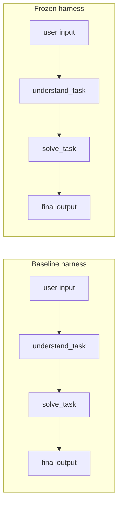

# stem_agent Evolution Report

stem_agent is a universal differentiation mechanism. This run grew a specialized operating harness from scenario signals.

## Before / After
- Baseline genome score: 0.4829
- Evolved genome score: 0.4829
- Frozen genome: `runs/demo_001/frozen_genome.yaml`
- Promotion split policy: weighted_train_validation_40_60

## Organism Shape

### Initial organism
- Roles: 1
- Workflow steps: 2
- Self-evaluation: disabled
- Quality gates: 0
- Generated tools: 0
- Environment artifacts: 0

### Final organism
- Roles: 1
- Workflow steps: 2
- Self-evaluation: disabled
- Quality gates: 0
- Generated tools: 0 accepted, 0 rejected
- Environment artifacts: 0

## Why This Is Evolution, Not Subagent Orchestration
stem_agent does not start with a hand-written set of PM/Engineer/QA agents. It starts with a minimal Founder genome. Every new role, workflow step, quality gate, tool, or workspace artifact must appear as a mutation. Guardian evaluates the mutated harness and only promotes changes that improve fitness.

## Promoted Mutations
- None

## Rejected Or Rolled Back Mutations
- mutation_rolled_back modify_retry_policy on : fitness did not improve enough for promotion
- mutation_rolled_back modify_retry_policy on : fitness did not improve enough for promotion
- mutation_rolled_back modify_retry_policy on : fitness did not improve enough for promotion
- mutation_rolled_back replace_genome on genome: fitness did not improve enough for promotion
- mutation_rolled_back replace_genome on genome: fitness did not improve enough for promotion
- mutation_rolled_back replace_genome on genome: fitness did not improve enough for promotion
- mutation_rolled_back replace_genome on genome: fitness did not improve enough for promotion

## Genome Archive
| Rank | Genome ID | Score | Generation | Parent ID |
|---:|---|---:|---:|---|
| 1 | `2e6977fe-b51f-4b30-90b8-0765c049bdc5` | 0.4829 | 3 | `3b01a210-133c-4ea6-ac47-8a6a6c770f9b` |
| 2 | `e346438d-3dd8-4df2-a574-20acfd713bc3` | 0.4829 | 4 | `94bbe2f3-89f6-465b-848d-4cc6a48e9b0d` |
| 3 | `0730645d-fb6d-4715-9c4b-4148dff8c294` | 0.4829 | 5 | `2a67ef5f-687a-4910-8463-ede50f46a8a9` |
| 4 | `3edd254f-ed1a-4678-a4cb-47094a35c8df` | 0.4829 | 2 | `2dfc34e6-585f-4107-8daa-e0a8a497d188` |
| 5 | `ff430ba7-c88e-4ed9-abb8-7985be419888` | 0.4829 | 3 | `0730645d-fb6d-4715-9c4b-4148dff8c294` |
| 6 | `219b2f85-7d5f-4839-8c2a-d6d2aae9c099` | 0.4829 | 4 | `e346438d-3dd8-4df2-a574-20acfd713bc3` |
| 7 | `fc6aa538-fdaf-4e72-ab72-4178836f1ae2` | 0.4829 | 5 | `377ac038-0ac1-4096-b726-bdcf5b5e7bff` |
| 8 | `373de27e-eaac-4757-a29b-a11f695ac5ed` | 0.4829 | 1 | `219b2f85-7d5f-4839-8c2a-d6d2aae9c099` |
| 9 | `8c2791c7-a921-4322-9c08-1e540695d1b9` | 0.4829 | 2 | `3edd254f-ed1a-4678-a4cb-47094a35c8df` |
| 10 | `efedcb4a-6625-48fb-9990-2099dd6cd47a` | 0.4829 | 3 | `219b2f85-7d5f-4839-8c2a-d6d2aae9c099` |

## Frozen Harness Shape
- Roles: Founder
- Workflow steps: understand_task, solve_task
- Environment artifacts: none
- Self-evaluation enabled: False

## Differentiation Story
stem_agent differentiation story

Scenario signals were interpreted by Nucleus, then converted into structured genome mutations.
- Generation 0 evaluated at 0.4829: Candidate satisfied visible requirements with acceptable complexity.
- Nucleus proposed modify_retry_policy on : Enabling revise_on_failure may allow the agent to improve outputs after initial failures, potentially increasing overall task success beyond the current single attempt strategy.
- Guardian rolled back modify_retry_policy on  because fitness did not improve enough for promotion.
- Generation 1 evaluated at 0.4829: Candidate satisfied visible requirements with acceptable complexity.
- Nucleus proposed modify_retry_policy on : Enabling revise_on_failure could allow the agent to improve answers upon failure, potentially increasing performance beyond the current neutral score after retry policy modification.
- Guardian rolled back modify_retry_policy on  because fitness did not improve enough for promotion.
- Generation 2 evaluated at 0.4829: Candidate satisfied visible requirements with acceptable complexity.
- Nucleus proposed modify_retry_policy on : Current retry policy with only 1 attempt might limit the solver's ability to recover from failures; increasing max_attempts could allow more retries and improve robustness.
- Guardian rolled back modify_retry_policy on  because fitness did not improve enough for promotion.
- Generation 3 evaluated at 0.4829: Candidate satisfied visible requirements with acceptable complexity.
- Nucleus proposed replace_genome on genome: zero_order selected because search stagnated or archive diversity was useful.
- Guardian rolled back replace_genome on genome because fitness did not improve enough for promotion.
- Generation 4 evaluated at 0.4829: Candidate satisfied visible requirements with acceptable complexity.
- Nucleus proposed replace_genome on genome: zero_order selected because search stagnated or archive diversity was useful.
- Guardian rolled back replace_genome on genome because fitness did not improve enough for promotion.
- Generation 5 evaluated at 0.4829: Candidate satisfied visible requirements with acceptable complexity.
- Nucleus proposed replace_genome on genome: zero_order selected because search stagnated or archive diversity was useful.
- Guardian rolled back replace_genome on genome because fitness did not improve enough for promotion.
- Generation 6 evaluated at 0.4829: Candidate satisfied visible requirements with acceptable complexity.
- Nucleus proposed replace_genome on genome: hyper selected because search stagnated or archive diversity was useful.
- Guardian rolled back replace_genome on genome because fitness did not improve enough for promotion.
- Evolution stopped at generation 6: maximum generation hard cap reached

<!-- STEM_AGENT_VISUALS_START -->
## Visual Overview

## OpenAI Run Metadata

| Field | Value |
|---|---|
| run mode | openai-api |
| model | gpt-4.1-mini |
| endpoint | auto |
| test_mode | False |
| fallback_used | True |
| responses_api_available | False |
| chat_completions_fallback | True |
| model calls | 61 |
| structured output repairs | 3 |
| total estimated cost | 0.06 |

Structured output repairs only normalize model JSON/schema output. They do not bypass Guardian validation or promote mutations.

# stem_agent Training Progress

- Run: `runs/demo_001`
- Status: frozen
- Latest generation: 6
- Best observed promotion score: 0.4829

## Promotion Score Chart

```mermaid
xychart-beta
  title "Promotion score by generation"
  x-axis [0, 1, 2, 3, 4, 5, 6]
  y-axis "score" 0 --> 1
  line [0.4829, 0.4829, 0.4829, 0.4829, 0.4829, 0.4829, 0.4829]
```

## Generation Scores

| Generation | Promotion | Train | Validation | Summary |
|---:|---:|---:|---:|---|
| 0 | 0.4829 | 0.4829 | 0.4829 | Candidate satisfied visible requirements with acceptable complexity. |
| 1 | 0.4829 | 0.4829 | 0.4829 | Candidate satisfied visible requirements with acceptable complexity. |
| 2 | 0.4829 | 0.4829 | 0.4829 | Candidate satisfied visible requirements with acceptable complexity. |
| 3 | 0.4829 | 0.4829 | 0.4829 | Candidate satisfied visible requirements with acceptable complexity. |
| 4 | 0.4829 | 0.4829 | 0.4829 | Candidate satisfied visible requirements with acceptable complexity. |
| 5 | 0.4829 | 0.4829 | 0.4829 | Candidate satisfied visible requirements with acceptable complexity. |
| 6 | 0.4829 | 0.4829 | 0.4829 | Candidate satisfied visible requirements with acceptable complexity. |

## Decision Timeline



## Mutation Decisions

| Generation | Decision | Mutation | Target | Score before | Score after | Reason |
|---:|---|---|---|---:|---:|---|
| 0 | rolled back | modify_retry_policy |  | 0.4829 | 0.4829 | fitness did not improve enough for promotion |
| 1 | rolled back | modify_retry_policy |  | 0.4829 | 0.4829 | fitness did not improve enough for promotion |
| 2 | rolled back | modify_retry_policy |  | 0.4829 | 0.4829 | fitness did not improve enough for promotion |
| 3 | rolled back | replace_genome | genome | 0.4829 | 0.4829 | fitness did not improve enough for promotion |
| 4 | rolled back | replace_genome | genome | 0.4829 | 0.4829 | fitness did not improve enough for promotion |
| 5 | rolled back | replace_genome | genome | 0.4829 | 0.4829 | fitness did not improve enough for promotion |
| 6 | rolled back | replace_genome | genome | 0.4829 | 0.4769 | fitness did not improve enough for promotion |
| 6 | frozen |  |  |  | 0.4829 | maximum generation hard cap reached |


## Evolution Timeline



## Initial vs Final Organism

| Shape signal | Initial organism | Final organism |
|---|---:|---:|
| Roles | 1 | 1 |
| Workflow steps | 2 | 2 |
| Self-evaluation | disabled | disabled |
| Quality gates | 0 | 0 |
| Generated tools | 0 | 0 accepted, 0 rejected |
| Environment artifacts | 0 | 0 |
| Score | 0.4829 | 0.4829 |

## Harness Before/After Graph



## Guardian Selection Board

| Generation | Mutation | Type | Decision | Score before | Score after | Guardian reason |
|---:|---|---|---|---:|---:|---|
| 0 |  | modify_retry_policy | rolled back | 0.4829 | 0.4829 | fitness did not improve enough for promotion |
| 1 |  | modify_retry_policy | rolled back | 0.4829 | 0.4829 | fitness did not improve enough for promotion |
| 2 |  | modify_retry_policy | rolled back | 0.4829 | 0.4829 | fitness did not improve enough for promotion |
| 3 | genome | replace_genome | rolled back | 0.4829 | 0.4829 | fitness did not improve enough for promotion |
| 4 | genome | replace_genome | rolled back | 0.4829 | 0.4829 | fitness did not improve enough for promotion |
| 5 | genome | replace_genome | rolled back | 0.4829 | 0.4829 | fitness did not improve enough for promotion |
| 6 | genome | replace_genome | rolled back | 0.4829 | 0.4769 | fitness did not improve enough for promotion |

## Hidden Eval vs Train Eval over Generations

No hidden evaluation scores recorded yet.

## Safe Stop And Recovery

- Run completed without pause.
- Checkpoints written at safe points.
- Best verified genome frozen.
- Candidate genome was not promoted without Guardian verification.
- Resume not needed for completed run.

## Why This Is Not Predefined Subagent Orchestration

Roles are not predefined subagents. They are phenotypic structures that survive only if Guardian fitness improves. In this run, a redundant role was rolled back, while workflow/tool/gate organs survived.

<!-- STEM_AGENT_VISUALS_END -->
