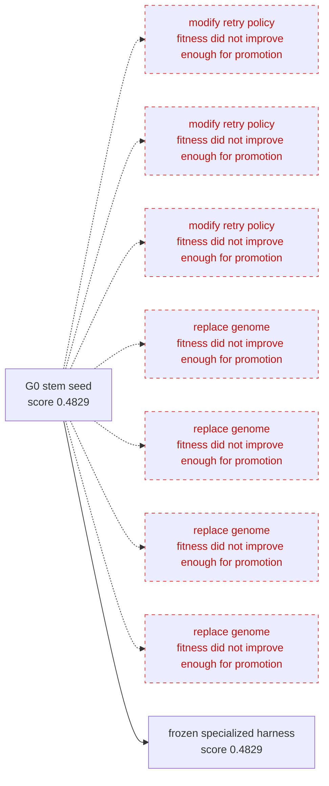

## Evolution Timeline

```mermaid
flowchart LR
  G0["G0 stem seed<br/>score 0.4829"]
  R0["modify retry policy<br/>fitness did not improve enough for promotion"]
  R1["modify retry policy<br/>fitness did not improve enough for promotion"]
  R2["modify retry policy<br/>fitness did not improve enough for promotion"]
  R3["replace genome<br/>fitness did not improve enough for promotion"]
  R4["replace genome<br/>fitness did not improve enough for promotion"]
  R5["replace genome<br/>fitness did not improve enough for promotion"]
  R6["replace genome<br/>fitness did not improve enough for promotion"]
  F["frozen specialized harness<br/>score 0.4829"]
  G0 -.-> R0
  G0 -.-> R1
  G0 -.-> R2
  G0 -.-> R3
  G0 -.-> R4
  G0 -.-> R5
  G0 -.-> R6
  G0 --> F
  classDef rejected stroke:#d33,color:#b11,stroke-dasharray: 5 5;
  class R0,R1,R2,R3,R4,R5,R6 rejected;
```