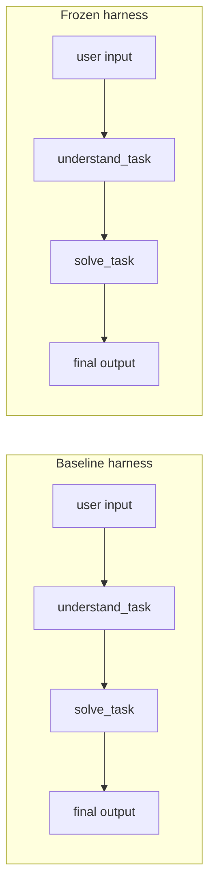

## Harness Before/After Graph

```mermaid
flowchart LR
  subgraph Baseline["Baseline harness"]
    BInput["user input"]
    BS0["understand_task"]
    BInput --> BS0
    BS1["solve_task"]
    BS0 --> BS1
    BOut["final output"]
    BS1 --> BOut
  end
  subgraph Frozen["Frozen harness"]
    FInput["user input"]
    FS0["understand_task"]
    FInput --> FS0
    FS1["solve_task"]
    FS0 --> FS1
    FOut["final output"]
    FS1 --> FOut
  end
```