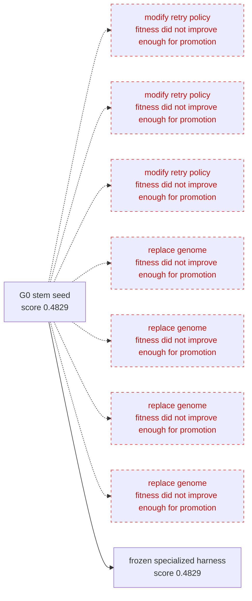
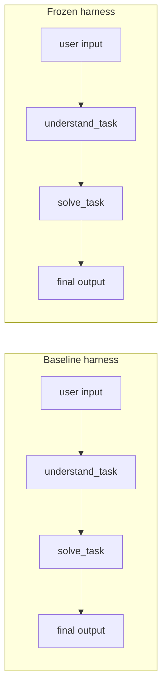

# stem_agent Visual Report


## Evolution Timeline



## Initial vs Final Organism

| Shape signal | Initial organism | Final organism |
|---|---:|---:|
| Roles | 1 | 1 |
| Workflow steps | 2 | 2 |
| Self-evaluation | disabled | disabled |
| Quality gates | 0 | 0 |
| Generated tools | 0 | 0 accepted, 0 rejected |
| Environment artifacts | 0 | 0 |
| Score | 0.4829 | 0.4829 |

## Harness Before/After Graph



## Guardian Selection Board

| Generation | Mutation | Type | Decision | Score before | Score after | Guardian reason |
|---:|---|---|---|---:|---:|---|
| 0 |  | modify_retry_policy | rolled back | 0.4829 | 0.4829 | fitness did not improve enough for promotion |
| 1 |  | modify_retry_policy | rolled back | 0.4829 | 0.4829 | fitness did not improve enough for promotion |
| 2 |  | modify_retry_policy | rolled back | 0.4829 | 0.4829 | fitness did not improve enough for promotion |
| 3 | genome | replace_genome | rolled back | 0.4829 | 0.4829 | fitness did not improve enough for promotion |
| 4 | genome | replace_genome | rolled back | 0.4829 | 0.4829 | fitness did not improve enough for promotion |
| 5 | genome | replace_genome | rolled back | 0.4829 | 0.4829 | fitness did not improve enough for promotion |
| 6 | genome | replace_genome | rolled back | 0.4829 | 0.4769 | fitness did not improve enough for promotion |

## Hidden Eval vs Train Eval over Generations

No hidden evaluation scores recorded yet.

## Before/After Output Comparison

Sample input: `Help me prepare for a difficult meeting with my manager about missed deadlines. I need to explain what happened, propose a recovery plan, and avoid sounding defensive.`

### Requirement Coverage Checklist
| Requirement | Baseline | Evolved |
|---|---:|---:|
| Must include a short summary | yes | yes |
| Must include concrete steps | yes | yes |
| Must include final answer | yes | yes |

### Baseline Output

```markdown
```markdown
### Summary
You want to prepare thoroughly for a difficult meeting with your manager about missed deadlines. The key is to clearly and honestly explain what happened, present a practical recovery plan, and communicate confidently without sounding defensive.

### Concrete Steps

1. **Prepare a Clear, Honest Explanation**  
   - Reflect on the main reasons for the missed deadlines (e.g., workload, unexpected obstacles, unclear priorities).  
   - Stick to facts and personal responsibility; avoid blaming others.  
   - Keep your explanation brief and to the point.

2. **Develop a Recovery Plan**  
   - Identify specific, actionable steps to get back on track (e.g., reorganize tasks, request support, adjust timelines).  
   - Set realistic deadlines and milestones.  
   - Outline how you will track and report progress to your manager.

3. **Practice Your Communication Style**  
   - Use calm, composed, and neutral language.  
   - Employ “I” statements to show ownership (e.g., “I recognize…”, “I am working on…”).  
   - Prepare responses to possible manager questions.  
   - Rehearse beforehand to build confidence and avoid sounding defensive.

4. **Conduct the Meeting Professionally**  
   - Begin by acknowledging the issue and your commitment to improve.  
   - Deliver your explanation succinctly, then transition quickly to the recovery plan.  
   - Invite feedback and demonstrate openness to suggestions.  
   - Stay calm if challenged; avoid interrupting or becoming defensive.

### Final Answer

To handle your meeting successfully:

- **Explain the situation factually:**  
  “I missed the deadlines due to [brief, honest reason]. I understand the impact this has had, and I take full responsibility.”

- **Present a clear recovery plan:**  
  “To address this, I’ve reprioritized my tasks, adjusted my workflow, and plan to complete everything by [new realistic date]. I will provide weekly updates on my progress.”

- **Maintain professionalism:**  
  Use “I” statements, keep a calm tone, and focus on solutions rather than excuses. Prepare and practice so you come across as accountable and proactive—not defensive.

This approach will help you communicate accountability and commitment effectively while fostering a positive next step with your manager.
```
```

### Evolved Output

```markdown
```markdown
### Summary
You need to prepare for a difficult meeting with your manager about missed deadlines by explaining what happened clearly and calmly, proposing a concrete recovery plan, and avoiding sounding defensive. The goal is to take accountability, focus on solutions, and maintain a professional tone.

### Concrete Steps

1. **Analyze What Happened**  
   - Identify the main factors that led to missed deadlines (e.g., underestimated effort, unexpected obstacles).  
   - Own your part without blaming others or making excuses.

2. **Craft a Clear, Concise Explanation**  
   - Begin with a brief, fact-based overview of the situation.  
   - Use “I” statements to convey ownership (e.g., “I misjudged the time needed…”).  
   - Acknowledge the impact on the team or project.

3. **Develop a Recovery Plan**  
   - Outline specific actions to get back on track (e.g., reorganizing priorities, seeking assistance, adjusting timelines).  
   - Set achievable milestones with deadlines.  
   - Include steps to prevent similar issues in the future (e.g., improved planning, regular updates).

4. **Practice Your Communication**  
   - Rehearse delivering your explanation and plan calmly and confidently.  
   - Avoid defensive phrases or tone (no “but” or “if only”).  
   - Stay solution-focused and open to feedback.

5. **Prepare for Questions**  
   - Anticipate concerns or questions your manager might have.  
   - Prepare honest and concise responses that reinforce your commitment to improvement.

6. **During the Meeting**  
   - Listen attentively and acknowledge your manager’s perspective.  
   - Emphasize next steps and your plan to move forward.  
   - Express appreciation for their understanding and support.

### Final Answer

To successfully navigate your meeting about missed deadlines, clearly and calmly explain what factors contributed to the delays using ownership-focused “I” statements. Present a detailed, actionable recovery plan that outlines how you will get back on schedule and prevent future issues. Maintain a professional, solution-oriented tone throughout, and be ready to listen and respond constructively to your manager’s concerns. This approach will demonstrate accountability and your commitment to improving performance.
```
```

## Safe Stop And Recovery

- Run completed without pause.
- Checkpoints written at safe points.
- Best verified genome frozen.
- Candidate genome was not promoted without Guardian verification.
- Resume not needed for completed run.

## Why This Is Not Predefined Subagent Orchestration

Roles are not predefined subagents. They are phenotypic structures that survive only if Guardian fitness improves. In this run, a redundant role was rolled back, while workflow/tool/gate organs survived.

## OpenAI Run Metadata

| Field | Value |
|---|---|
| run mode | openai-api |
| model | gpt-4.1-mini |
| endpoint | auto |
| test_mode | False |
| fallback_used | True |
| responses_api_available | False |
| chat_completions_fallback | True |
| model calls | 61 |
| structured output repairs | 3 |
| total estimated cost | 0.06 |

Structured output repairs only normalize model JSON/schema output. They do not bypass Guardian validation or promote mutations.